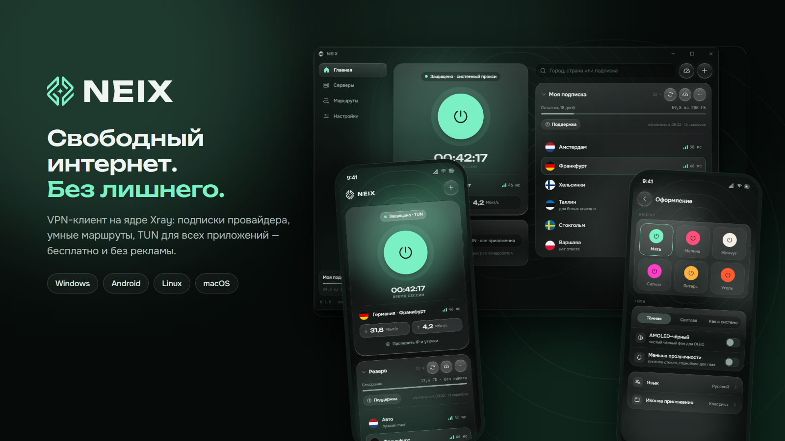
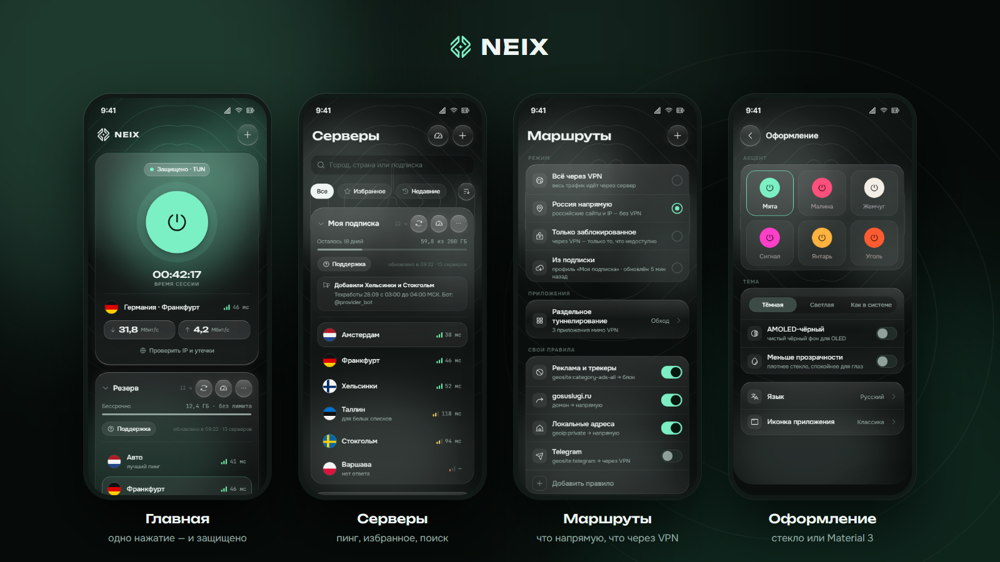
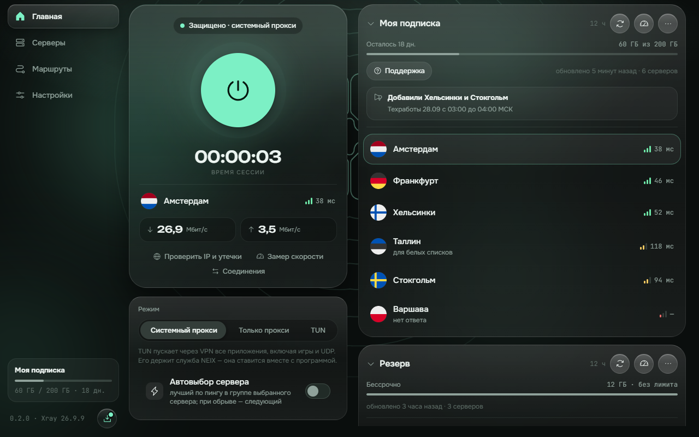
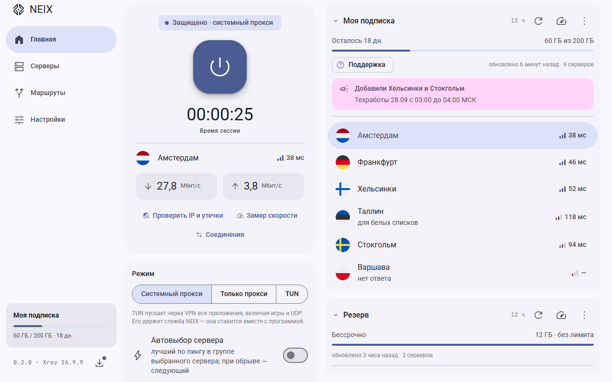

# NEIX

**Свободный интернет. Без лишнего.** Бесплатный VPN-клиент на ядре Xray для Windows, Android,
Linux и macOS: добавьте подписку своего провайдера — и одно нажатие защищает весь компьютер или
телефон. Без рекламы, без регистрации, без наших серверов: NEIX — только клиент.

**[Скачать последнюю версию →](https://github.com/dizzzable/neix/releases/latest)**

## Что умеет

- **Подписки провайдеров** — ссылки, Remnawave, полные JSON-конфиги Xray, Clash/mihomo, WireGuard;
  трафик, срок и объявления провайдера прямо в приложении.
- **Протоколы Xray** — VLESS (REALITY, XHTTP, Vision), VMess, Trojan, Shadowsocks и Shadowsocks 2022,
  Hysteria2, WireGuard.
- **Весь трафик или только нужное** — TUN для всех приложений (игры и UDP тоже), системный прокси
  или только прокси; раздельное туннелирование по приложениям.
- **Маршруты** — «Россия напрямую», «только заблокированное», свои правила по сайтам и приложениям.
- **Надёжность** — kill switch, автовыбор живого сервера, раздача VPN через точку доступа на Android.
- **Приватность** — ключи и ссылки шифруются на устройстве, журнал без секретов, никакой телеметрии.
- **Оформление** — «стекло» или Material 3, двенадцать акцентов, светлая и тёмная тема.
- **Сам обновляется** — подписанные обновления с этой страницы.

  
  

## Где работает

| Система | Что скачать |
|---|---|
| Windows 10/11 (x64) | `NEIX_…_x64-setup.exe` |
| Android 7+ (телефоны, планшеты, ТВ) | `NEIX_…_android_universal.apk` |
| Linux (x64) | `.deb`, `.rpm` или `.AppImage` |
| macOS 13+ (Apple Silicon и Intel) | `.dmg` |

Все файлы — на странице [релизов](https://github.com/dizzzable/neix/releases). Сборки подписаны; NEIX
обновляется сам и принимает только обновления, подписанные нашим ключом.

## Лицензия

NEIX бесплатен; исходный код приложения закрыт. Условия — в
[LICENSE.md](LICENSE.md). NEIX построен на открытых компонентах, их список и лицензии — в приложении:
**О NEIX → Лицензии сторонних компонентов**. Ядро — наш форк [Xray-core](https://github.com/XTLS/Xray-core)
(MPL-2.0); его исходники с нашими изменениями приложены к каждому релизу (`xray-core-src-….tar.gz`).

---

<b>English</b>

**NEIX** is a free VPN client built on the Xray core for Windows, Android, Linux and macOS. Add your
provider's subscription and one tap protects the whole device — TUN for every app, system proxy,
split tunneling, rule-based routing, kill switch, automatic server choice, signed self-updates. No
ads, no sign-up, no servers of ours: NEIX is only a client.
[Download the latest release](https://github.com/dizzzable/neix/releases/latest). Free of charge; the
application's source is closed ([LICENSE.md](LICENSE.md)). The engine is our fork of
Xray-core (MPL-2.0); its source ships with every release (`xray-core-src-….tar.gz`).

